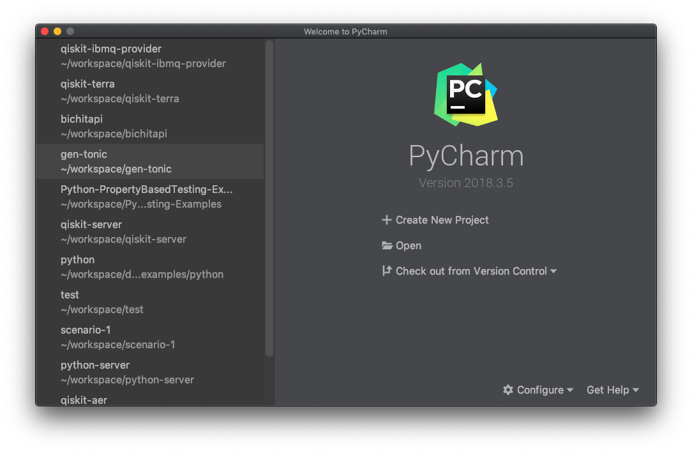
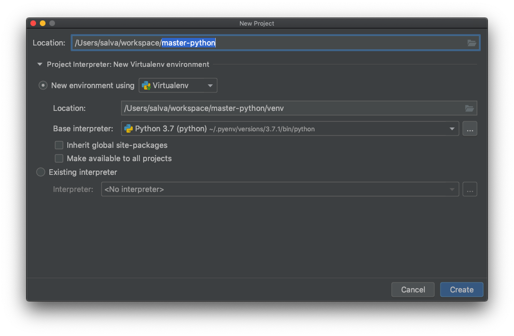

# PyCharm: edición y depuración

[PyCharm](https://www.jetbrains.com/pycharm/) es un entorno de desarrollo
integrado o _IDE_, por sus siglas en inglés, desarollado por la compañía
[JetBrains](https://www.jetbrains.com), autora también del famosísimo IDE
IntelliJ IDEA, para el lenguaje de programación Java.

PyCharm viene en dos versiones, una de pago y otra gratuita. A lo largo del
curso utilizaremos la versión gratuita o _community_. Puedes
[descargarla desde la web](https://www.jetbrains.com/pycharm/download/),
para los sistemas operativos Windows, OSX y Linux.

## Nuevo proyecto

La ventana de bienvenida de PyCharm permite crear y cargar proyectos. Un
proyecto de PyCharm no es más que un directorio con la carpeta especial `.idea`
en su interior. Como la carpeta comienza con un punto `.`, por defecto no será
visible en el explorador de carpetas de Linux o Mac.

Haciendo clic en "_Create New Project_", PyCharm ofrece la ventana de nuevo
proyecto, en la que podremos seleccionar el entorno de desarrollo que
utilizaremos en el proyecto.

Cada proyecto creado con PyCharm se ejecuta en un entorno distinto que puedes
considerar como una instalación "limpia" de Python. Estas configuraciones se
denominan entornos virtuales y [hablaremos más sobre ellos](./b03t08.md) en el
futuro.

## Edición

## Ejecución

## Depuración

## Recursos