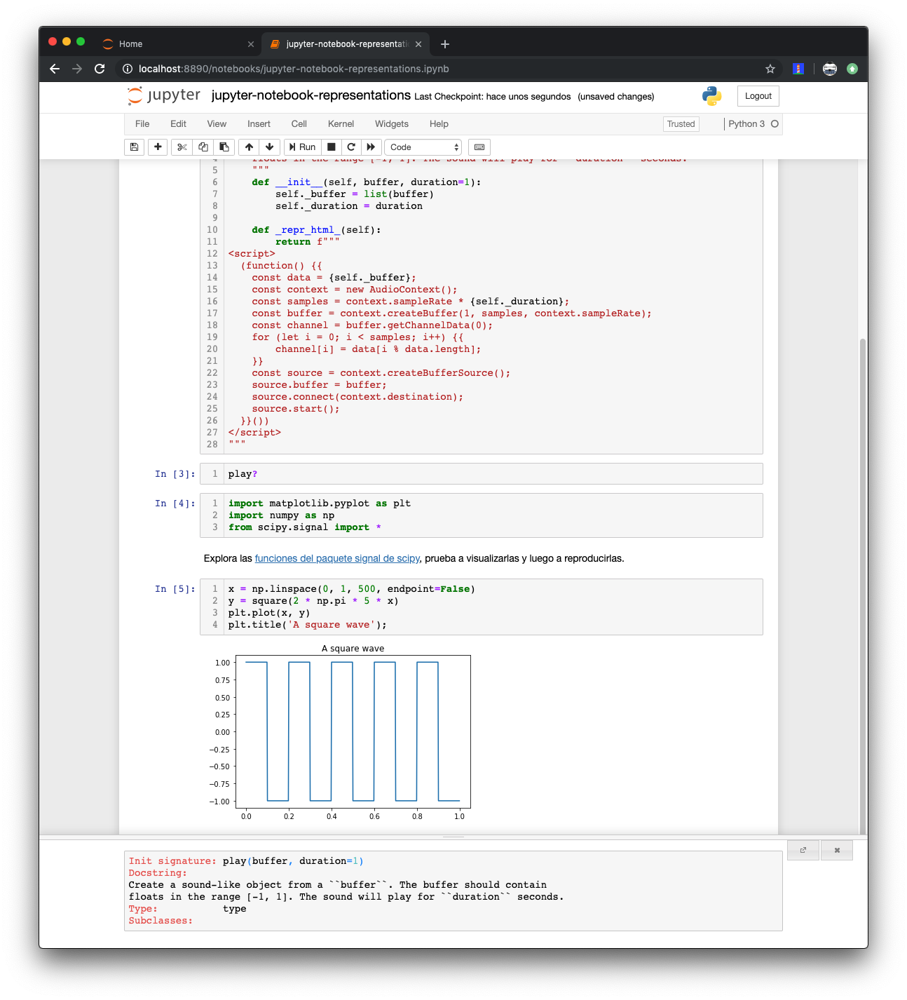

# Python al servicio de la ciencia

## Anaconda

Anaconda es una **distribución de Python y R, de carácter científico**.
Es decir, no es un intérprete distinto sino un ecosistema alrededor de Python
que surge para simplificar la gestión de paquetes de Python y aglutinar
software relacionado con la investigación científica.

### Anaconda-Navigator

Puedes instalar Anaconda desde
[su página web](https://www.anaconda.com/distribution/). Una vez lo instales
tendrás acceso Anaconda-Navigator, la interfaz gráfica de Anaconda para lanzar
aplicaciones, gestionar entornos virtuales, paquetes y canales.

**Importante**: si pretendes usar la línea de comandos, utiliza el instalador
de línea de comandos. Busca el enlace bajo la versión de Anaconda (Python 3.7
o Python 2.7) que quieras usar.


Anaconda-Navigator está dividido en 4 secciones:

- _Home_ con las aplicaciones de la distribución.
- _Environments_ con los entornos virtuales.
- _Learning_ con diverso material formativo.
- _Community_ con enlaces al material de comunidad de Anaconda.

En Anaconda, los entornos virtuales se utilizan de manera distinta a la que has
estudiado a lo largo del curso. Con Anaconda, un mismo entorno virtual puede
dar soporte a más de un proyecto. Activar el entorno virtual se traduce en
seleccionar el que corresponda. En macOS, el directorio donde se encuentran los
entornos virtuales es `/User/<username>/anaconda3/envs/`.

Puedes crear un nuevo entorno virtual yendo a la pestaña de entornos, y luego
haciendo clic en "_New_". Alternar entre uno y otro es tan sencillo como
seleccionar el adecuado en cada momento.

El botón con el símbolo de _play_, a la derecha del entorno virtual permite
lanzar varias utilidades de la línea de comandos.

**Importante**: es posible que estas utilidades no te funcionen si seguiste
la guía de instalación del entorno del curso porque Anaconda espera que tu
_shell_ sea `bash` y no `zsh`. Puedes seguir el procedimiento descrito en
[Getting Anaconda to work with Oh My ZSH on Mac OS X](https://medium.com/@sumitmenon/how-to-get-anaconda-to-work-with-oh-my-zsh-on-mac-os-x-7c1c7247d896)
para arreglar el problema.

**No es aconsejable usar Anaconda y otro gestor de entornos virtuales**. La
solución anterior activará el entorno por defecto (_base_) cuando ejecutemos
una nueva terminal y es posible tener más de un entorno virtual activado al
mismo tiempo. Sea como sea, para desactivar el entorno de Anaconda, puedes
escribir:

```bash
$ conda deactivate
```

### IPython

Una de las características más aclamadas de Anaconda es
[IPython](https://ipython.org/), una terminal interactiva multilenguaje pero
inicialmente diseñada para Python. La consola interactiva IPython añade
mejoras al intérprete interactivo de Python por defecto como pueden ser el
coloreado de sintaxis, un histórico más rico, autocompletado, ayuda mejorada,
comunicación con el _shell_, etc.

1. Escribe algunas expresiones:

    ```ipython
    In [1]: print('Hello!')
    Hello!

    In [2]: 6 * 7
    Out[2]: 42

    In [3]: for i in range(5):
    ...:     print(i)
    ...:
    ```

    Notarás que algunas salidas comienzan por una marca `Out[n]` y otras
    no. También verás que IPython intenta ver cuándo has terminado de
    escribir una sentencia o cuando aún te encuentras escribiendo un bloque.
    Puedes forzar la inserción de espacios en blanco con `ctrl+o` o la
    ejecución de un bloque con `Esc, Enter`.

2. En cualquier momento, puedes escribir `?` para imprimir una guía rápida
de IPython. Lee la ayuda para conocer las características principales
de IPython.

3. Puedes utilizar las variables dinámicas `_<n>` para acceder a la salida
etiquetada con `<n>` correspondiente a la marca `Out[<n>]`.

    ```ipython
    In [12]: map(lambda x: x*2, [1,2,3])
    Out[12]: <map at 0x112203ba8>

    In [13]: list(_12)
    Out[13]: [2, 4, 6]
    ```

4. IPython permite ejecutar código en la terminal subyacente escribiendo
el comando precedido del símbolo de cierre de exclamación `!`:

    ```ipython
    In [19]: !ls
    Applications
    Creative Cloud Files
    Desktop
    Documents
    Downloads
    Dropbox
    Library
    Movies
    Music
    Pictures
    Public
    anaconda3
    antigen.zsh
    presentations
    test
    workspace
    ```

    También se puede utilizar a la derecha de una asignación para guardar
    la salida por línea:

    ```ipython
    In [20]: files = !ls

    In [21]: _
    Out[21]:
    ['Applications',
    'Creative Cloud Files',
    'Desktop',
    'Documents',
    'Downloads',
    'Dropbox',
    'Library',
    'Movies',
    'Music',
    'Pictures',
    'Public',
    'anaconda3',
    'antigen.zsh',
    'presentations',
    'test',
    'workspace']
    ```

5. Existen una serie de funcionalidades, los llamados comandos (o funciones)
mágicos, que comienzan por el símbolo porcentaje `%`:

    ```ipython
    In [24]: %rerun 9
    === Executing: ===
    for i in range(5):
        print(i)

    === Output: ===
    0
    1
    2
    3
    4
    ```

    Una función mágica también puede comenzar por el doble símbolo porcentaje
    `%%` si afecta a un bloque (o celda, en la jerga de IPython):

    ```ipython
    In [29]: %%timeit
    ...: for i in range(1000):
    ...:     i**2
    ...:
    275 µs ± 3.98 µs per loop (mean ± std. dev. of 7 runs, 1000 loops each)

    In [30]: %timeit (i**2 for i in range(1000))
    559 ns ± 16 ns per loop (mean ± std. dev. of 7 runs, 1000000 loops each)
    ```

6. IPython es extremadamente potente y muy configurable, permitiendo cargar
comandos mágicos externos, crear los nuestros propios, ejecutar código Python
al inicio, etc... Para configurar IPython ejecuta, desde una terminal, el
siguiente comando:

    ```bash
    $ ipython profile create
    ```

    Esto creará una configuración en `~/.ipython/profile_default`. Lo que
    quieras cargar al comienzo de cada sesión puedes ponerlo en
    `~/.ipython/profile_default/startup`. Los _scripts_ se cargarán en orden
    alfabético.

### Un comando mágico personalizado

Crea un fichero `10-zen-magic.py` y dentro escribe lo siguiente:

```python
import random

from IPython.core.magic import register_line_magic

@register_line_magic
def zen(line):
    print(random.choice("""Beautiful is better than ugly.
Explicit is better than implicit.
Simple is better than complex.
Complex is better than complicated.
Flat is better than nested.
Sparse is better than dense.
Readability counts.
Special cases aren't special enough to break the rules.
Although practicality beats purity.
Errors should never pass silently.
Unless explicitly silenced.
In the face of ambiguity, refuse the temptation to guess.
There should be one-- and preferably only one --obvious way to do it.
Although that way may not be obvious at first unless you're Dutch.
Now is better than never.
Although never is often better than right now.
If the implementation is hard to explain, it's a bad idea.
If the implementation is easy to explain, it may be a good idea.
Namespaces are one honking great idea -- let's do more of those!""".split('\n')))
```

Ahora comienza una sesión IPython y ejecuta:

    ``ìpython
    In [1]: %zen
    If the implementation is easy to explain, it may be a good idea.
    ```

* La lista de los [comandos mágicos](https://ipython.readthedocs.io/en/stable/interactive/magics.html) incluídos.
* [Documentación de IPython](https://ipython.readthedocs.io/en/stable/)
* [Comandos mágicos personalizados](https://ipython.readthedocs.io/en/stable/config/custommagics.html#defining-magics)

## Jupyter Notebook

IPython incluía una herramienta de "cuaderno de notas" o _notebooks_ para
mezclar código, texto y visualizaciones de datos. Este proyecto se separó
en [Jupyter Notebook](https://jupyter.org/) pero se incluye junto con Anaconda.

Jupyter Notebook expone IPython a través de una interfaz web:



De esta forma permite mostrar resultados más ricos visualmente, que además
de código incluyen texto y contenido multimedia.

1. Jupyter Notebook tiene dos modos de comandos. El "modo edición", que se
activa haciendo click en el interior de una celda, o pulsando `Enter` en
la celda seleccionada en el "modo comando".

2. El "modo comando" que se accede pulsando `Esc` desde el "modo edición".

3. Para ejecutar una celda no basta con pulsar `Enter` (que simplemente
introducirá un salto de línea), sino que se debe pulsar la combinación
`shift + Enter`.

4. De manera inmediata, todo lo que puede hacerse en IPython, puede hacerse
en Jupyter Notebook. Prueba algunos de los comandos que practicaste en la
sección anterior.

Es conveniente coger soltura con el control por teclado de Notebook:

| Tecla                | Efecto                                    |
|----------------------|-------------------------------------------|
| `esc`                | Cambia al modo comando.                   |
| En el modo comando:                                              |
| `d, d`               | Elimina una celda.                        |
| `A`                  | Añade una celda arriba.                   |
| `B`                  | Añade una celda debajo.                   |
| `H`                  | Cambia el tipo de la celda a Markdown.    |
| `Y`                  | Cambia el tipo de la celda a código.      |
| Flechas arriba/abajo | Cambian entre la celda superior/inferior. |
| `enter`              | Cambia al modo edición.                   |
| En el modo edición:                                              |
| `enter`              | Inserta una línea en blanco.              |
| `shift+enter`        | Ejecuta la celda.                         |

### Integración con IPython y Jupyter Notebook

La llamada integración con Notebook tiene más de integración con IPython que
con Jupyter, realmente, pues depende del _kernel_ que estemos corriendo:

1. Si una clase implementa el método `_repr_html_()`, el resultado del
método será el contenido de la celda:

    ```python
    class play:
        """
        Create a sound-like object from a ``buffer``. The buffer should contain
        floats in the range [-1, 1]. The sound will play for ``duration`` seconds.
        """
        def __init__(self, buffer, duration=1):
            self._buffer = list(buffer)
            self._duration = duration

        def _repr_html_(self):
            return f"""
    <script>
    (function() {{
        const data = {self._buffer};
        const context = new AudioContext();
        const samples = context.sampleRate * {self._duration};
        const buffer = context.createBuffer(1, samples, context.sampleRate);
        const channel = buffer.getChannelData(0);
        for (let i = 0; i < samples; i++) {{
            channel[i] = data[i % data.length];
        }}
        const source = context.createBufferSource();
        source.buffer = buffer;
        source.connect(context.destination);
        source.start();
    }}())
    </script>
    """
    ```

1. Prueba la clase anterior con las siguientes celdas de Python:

    ```python
    import matplotlib.pyplot as plt
    import numpy as np
    from scipy.signal import *
    ```

    ```python
    x = np.linspace(0, 1, 500, endpoint=False)
    y = square(2 * np.pi * 5 * x)
    plt.plot(x, y)
    plt.title('A square wave')
    ```

    ```python
    play(y)
    ```

* Guía de [integración con IPython](https://ipython.readthedocs.io/en/stable/config/integrating.html).

### Jupyter _Kernels_

Los _kernels_ son los motores de Jupyter Notebook. Son los encargados de
ejecutar el código de las celdas. IPython se conoce como el "_kernel zero_"
y se trata del _kernel_ de referencia. Como es obvio, ejecuta Python.

Los botones en la parte superior con un simbolo de avance, _stop_, flecha
circular, y avance rápido, están directamente relacionados con los _kernel_.

- El botón de avance, etiquetado "_Run_", ejecuta la celda actual.
- El botón de _stop_ termina la ejecución del _kernel_. Equivalente a pulsar
`ctrl+c` en el intérprete interactivo.
- La flecha circular, o "reinicio", reinicia el _kernel_.
- El botón de avance rápido, o "re-ejecución", reinicia el _kernel_ y ejecuta
todas las celdas, como el comando anterior.

* Listado de [_kernels_ para Jupyter](https://github.com/jupyter/jupyter/wiki/Jupyter-kernels).

### Jupyter Lab

[Jupyter Lab](https://github.com/jupyterlab/jupyterlab)
trata de ser un reemplazo de Jupyter Notebook, orientado
tanto a la edición de _scripts_ como a la edición de _notebooks_, pero
también al manejo de consolas, documentos de datos, terminales... de manera
integrada y extensible. Se presenta como:

> An extensible environment for interactive and reproducible computing.


## Bibliotecas científicas y de alto rendimiento

La curva de entrada de Python es un reclamo para el lenguaje, que pretende
que el desarrollador preste más atención a los aspectos algorítmicos del
problema que está resolviendo, en vez de a la eficiencia de la implementación.

Sin embargo, la necesidad de manipular grandes cantidades de información hace
casi obligatorio el **uso de extensiones nativas eficientes**. El ecosistema
que se presenta a continuación sacrifica poco en cuanto a estilo y ofrece
ganancias en velocidad de ejecución y agilidad en el desarrollo notables.

* Búsqueda [Python libraries for data science](https://www.google.com/search?client=firefox-b-d&q=python+libraries+for+data+science) en Google.
* [Top 20 Python libraries for Data Science](https://bigdata-madesimple.com/top-20-python-libraries-for-data-science/).

### Matplotlib

[Matplotlib](https://matplotlib.org) es una biblioteca para visualizar
gráficas. Es un estándar de facto y acompañante obligatorio de otras
bibliotecas de carácter científico como NumPy, Pandas o SciPy. De hecho, el
formato de entrada que esperan la mayoría de funciones de Matplotlib es el
`ndarray` de NumPy.

* Puedes encontrar una
[lista extensiva de tutoriales](https://matplotlib.org/tutorials/)
en la página web de Matplotlib.

### NumPy

[NumPy](https://www.numpy.org/) es una biblioteca de extensiones Python
que implementan una estructura de datos, el `ndarray` y un conjunto de
operaciones para la eficiente manipulación de la misma.

Los `ndarray` (de _n-dimensional array_) son _arrays_ homogéneos (es decir,
de un sólo tipo de elemento) y contiguos en memoria.

El principal inconveniente de NumPy es su limitada capacidad para
redimensionar estos _array_. La biblioteca
[Blaze](https://blaze.readthedocs.io/en/latest/) trata de solventar estos
problemas.

* El tutorial rápido de
[SciPy.org](https://docs.scipy.org/doc/numpy/user/quickstart.html) sobre NumPy.

### SciPy

[SciPy](https://www.scipy.org/) es una biblioteca y ecosistema construido
sobre NumPie. De hecho, al comienzo eran un único proyectos, pero la
estructura de datos `ndarray` se separó para no obligar al usuario de la misma
a instalar todo el conjunto de herramientas de cálculo incluído con SciPy.

SciPy es un reemplazo de Matlab y ofrece un rendimiento similar.

* Más que un tutorial, SciPy.org incluye una serie de
[guías de uso modularizadas](https://docs.scipy.org/doc/scipy/reference/tutorial/).

### Pandas

[Pandas](https://pandas.pydata.org/) complementa a NumPy con nuevas estructuras
de datos y es parte del ecosistema SciPy. Pandas provee al usuario de
estructuras de alto nivel construidas sobre el `ndarray` de NumPy. Las
principales de estas estructuras son las _series_ y los _dataframes_.

Los primeros pueden verse como una generalización de los `ndarray`, donde
los índices se definen explícitamente. Los segundos son generalizaciones
de las series. Puedes pensar en ellos como tablas de una base de datos.

* El tutorial de introducción
[10 minutes to Pandas](https://pandas.pydata.org/pandas-docs/stable/getting_started/10min.html)